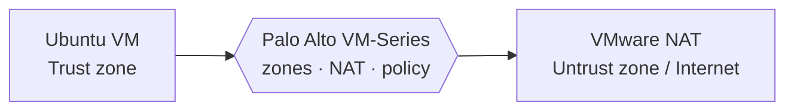

<p align="center">
  
</p>

<p align="center">
  <a href="https://www.linkedin.com/in/okraghavgupta"><b>LinkedIn</b></a> ·
  <a href="mailto:okraghavgupta@gmail.com"><b>Email</b></a>
</p>

<p align="center">
  
  
  
</p>

---

## 01 · Flagship project

### [Palo Alto Firewall Labs](https://github.com/raghavguptaa/palo-alto-firewall-labs)

Hands-on labs on a Palo Alto next-generation firewall, built the way a real deployment is done: interfaces first, then routing, NAT, policy and monitoring.

| 7 | 3 | 1 |
|:---:|:---:|:---:|
| labs, in real deployment order | zones: Trust, Untrust, management | firewall built from scratch in VMware |



- Configured Layer 3 Trust and Untrust interfaces, a virtual router and static routing
- Set up source NAT and security policy rules, then tested website and application blocking
- Used traffic logs and monitoring to verify policy behaviour and troubleshoot

`Palo Alto VM-Series` · `VMware Workstation` · `Ubuntu` · `PuTTY` · `Web GUI` · [Repository →](https://github.com/raghavguptaa/palo-alto-firewall-labs)

---

## 02 · About

Final-year B.Tech Computer Science student at **SRM Institute of Science and Technology, Delhi-NCR** (CGPA 9.14/10), focused on **network and perimeter security**. I learn by building: firewall labs, vulnerability assessments on Kali Linux, and a hybrid AES + RSA encryption tool in Python.

```text
now   building hands-on network security labs
      working with Palo Alto firewalls, Wireshark and Nmap
      open to internships and 2027 new-grad roles
```

| 9.14 | 3 mo | 3 | 7 |
|:---:|:---:|:---:|:---:|
| CGPA out of 10 | cybersecurity internship | industry certifications | firewall labs completed |

---

## 03 · Experience

| Period | Role |
|:---|:---|
| **May 2025 – Jul 2025** | **Cybersecurity Analyst Intern**<br>Polysia Tech Pvt Ltd, Noida<br><br>• Supported cloud infrastructure deployments across **GCP and AWS**, focusing on operational support and system reliability<br>• Ran **vulnerability assessments with Kali Linux**, analysing findings to support mitigation<br>• Built a Python **encryption/decryption tool** using a hybrid **AES + RSA** model for secure data protection |

---

## 04 · Certifications

- **Palo Alto Networks Certified Cybersecurity Practitioner**
- **Palo Alto Networks Certified Cybersecurity Apprentice**
- **Fortinet Certified Fundamentals**

---

## 05 · Stack

```text
network    TCP/IP · Routing & Switching · DNS · DHCP · HTTP/S · SSL/TLS · NAT
firewall   Palo Alto Networks (zones, policies, NAT, logs)
security   VAPT · Vulnerability Management · Threat Modelling · Phishing & Malware Analysis
defense    Log Analysis · Incident Response · Splunk
tools      Kali Linux · Wireshark · Nmap
crypto     AES-256-GCM · RSA · Web Crypto API
cloud      AWS (EC2 · VPC · S3 · ALB · CloudWatch · IAM · Lambda · CloudTrail · Route 53) · GCP · Azure
```

---

## 06 · Contact

**Best way to reach me:** [okraghavgupta@gmail.com](mailto:okraghavgupta@gmail.com) · [LinkedIn](https://www.linkedin.com/in/okraghavgupta)
