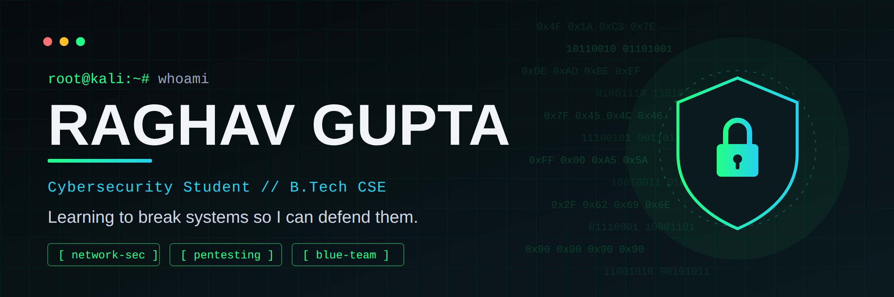
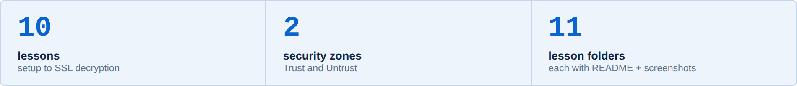
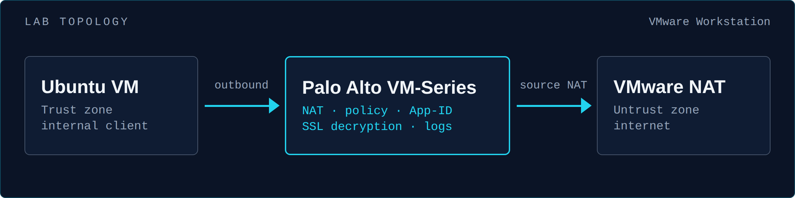
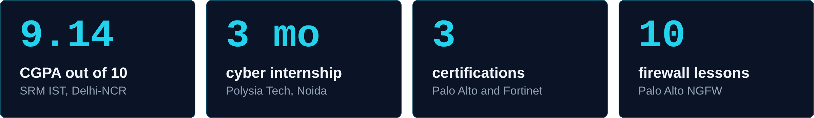
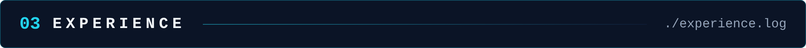
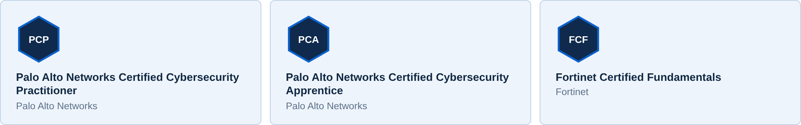
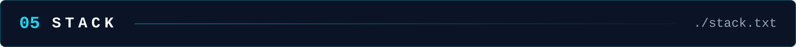
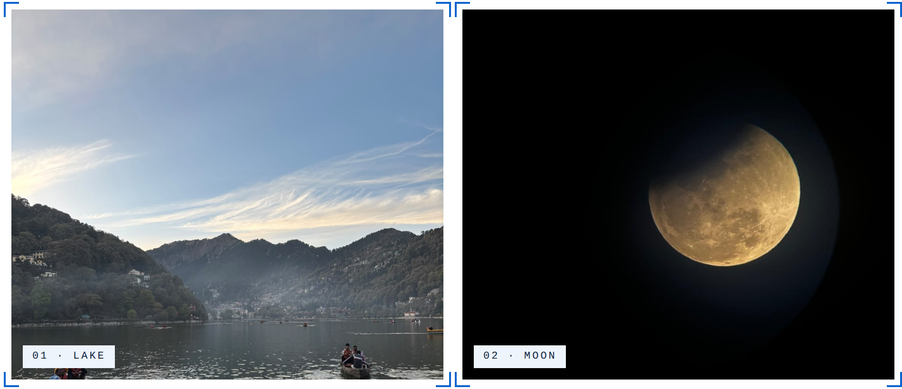

<h3><a href="https://github.com/raghavguptaa/Enterprise-Network-Security-Implementation-using-Palo-Alto-Next-Generation-Firewall-NGFW-">Enterprise Network Security with Palo Alto NGFW</a></h3>

<b>Hands-on Palo Alto next-generation firewall labs, built in real deployment order: from interfaces to SSL decryption.</b>

<ul>
<li>Configured Layer 3 Trust and Untrust interfaces, static routing, source NAT and security policy rules.</li>
<li>Built App-ID based policies, FQDN website blocking and URL filtering, then checked every change in the traffic logs.</li>
<li>Added QoS, ICMP flood / DoS protection and SSL decryption. Every lesson has its own write-up and screenshots.</li>
</ul>

<code>Palo Alto VM-Series</code> · <code>VMware Workstation</code> · <code>Ubuntu</code> · <code>PuTTY</code> · <code>Web GUI</code> · <a href="https://github.com/raghavguptaa/Enterprise-Network-Security-Implementation-using-Palo-Alto-Next-Generation-Firewall-NGFW-">Repository →</a>

Final-year B.Tech Computer Science student at <b>SRM Institute of Science and Technology, Delhi-NCR</b> (CGPA 9.14/10) and a <b>Palo Alto Networks Certified Cybersecurity Practitioner</b> who builds and secures network infrastructure.

I like hands-on labs where I can see the result. I built a 10-lesson Palo Alto firewall lab series from scratch, and during a cybersecurity internship I ran vulnerability assessments on Kali Linux and built a hybrid AES + RSA encryption tool in Python.

<pre>now  building hands-on network security labs      working with Palo Alto firewalls, Wireshark and Nmap      open to internships and 2027 new-grad roles</pre>

<table>
<tr>
<td valign="top" width="130"><code>2025-05 →</code> <code>2025-07</code></td>
<td><b>Cybersecurity Analyst Intern</b> Polysia Tech Pvt Ltd, Noida
<ul>
<li>Supported cloud infrastructure deployments across <b>GCP and AWS</b>, focusing on operational support and system reliability.</li>
<li>Ran <b>vulnerability assessments with Kali Linux</b>, analysing findings to support mitigation.</li>
<li>Built a Python <b>encryption/decryption tool</b> using a hybrid <b>AES + RSA</b> model for secure data protection.</li>
</ul></td>
</tr>
</table>

<pre>network   TCP/IP · Routing &amp; Switching · DNS · DHCP · HTTP/S · SSL/TLS · NAT firewall  Palo Alto Networks (zones, policies, NAT, App-ID, logs) security  VAPT · Vulnerability Management · Threat Modelling · Phishing &amp; Malware Analysis defense   Log Analysis · Incident Response · Splunk tools     Kali Linux · Wireshark · Nmap crypto    AES-256-GCM · RSA · Web Crypto API cloud     AWS (EC2 · VPC · S3 · ALB · CloudWatch · IAM · Lambda · CloudTrail · Route 53) · GCP · Azure</pre>

  <picture>
    <source media="(prefers-color-scheme: dark)" srcset="https://raw.githubusercontent.com/raghavguptaa/raghavguptaa/output/github-snake-dark.svg" />
    
  </picture>

<b>Core Member, Axions Dance Club, SRM IST</b> · <code>Dec 2023 – Present</code> 
Dance · the one place I switch off and just move.

<b>Travel</b> · new states, new cities, long train rides.

<a href="https://raghavguptaa.github.io">Full portfolio →</a>

<b>Best way to reach me:</b> <a href="mailto:okraghavgupta@gmail.com">okraghavgupta@gmail.com</a> · <a href="https://www.linkedin.com/in/okraghavgupta">LinkedIn</a>

